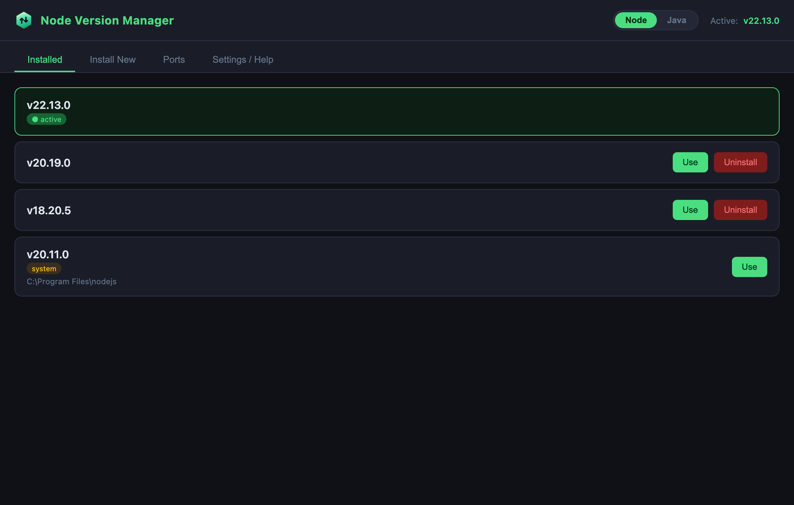
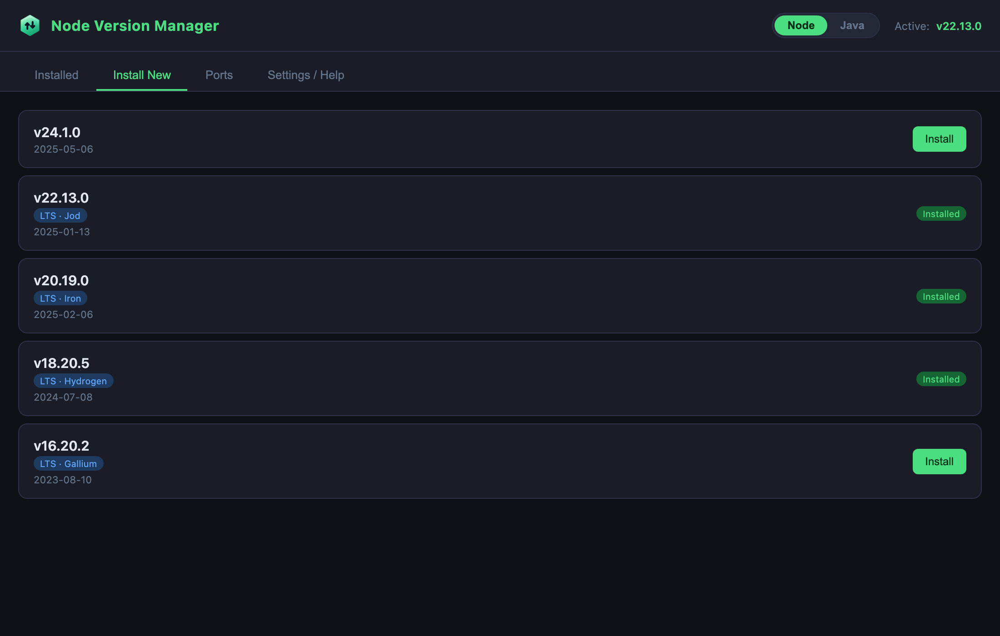
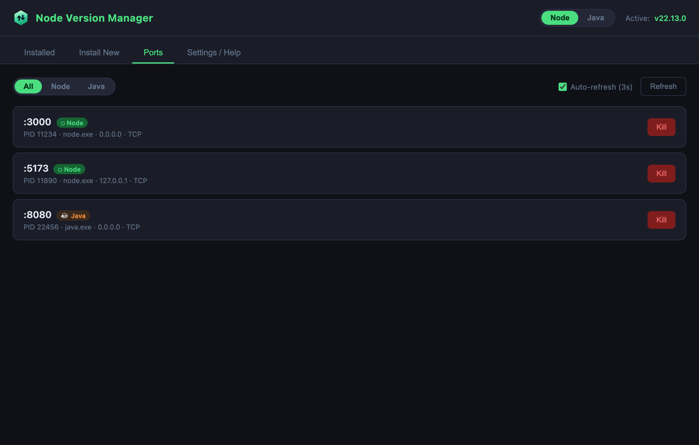
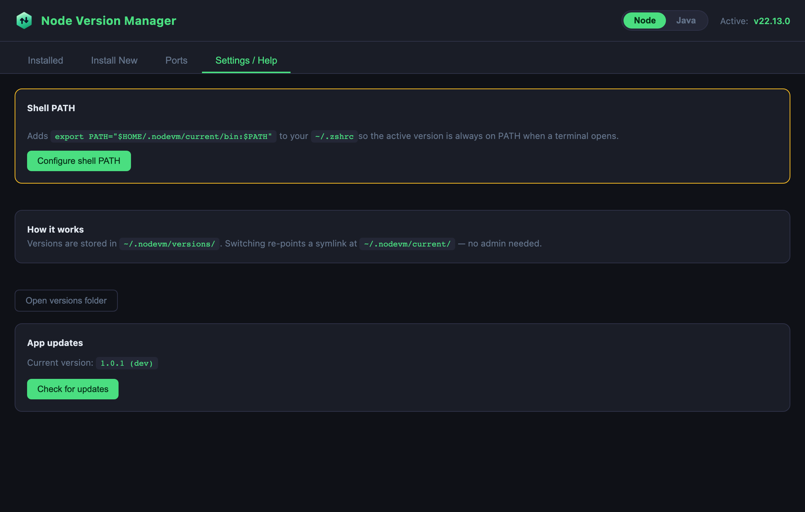
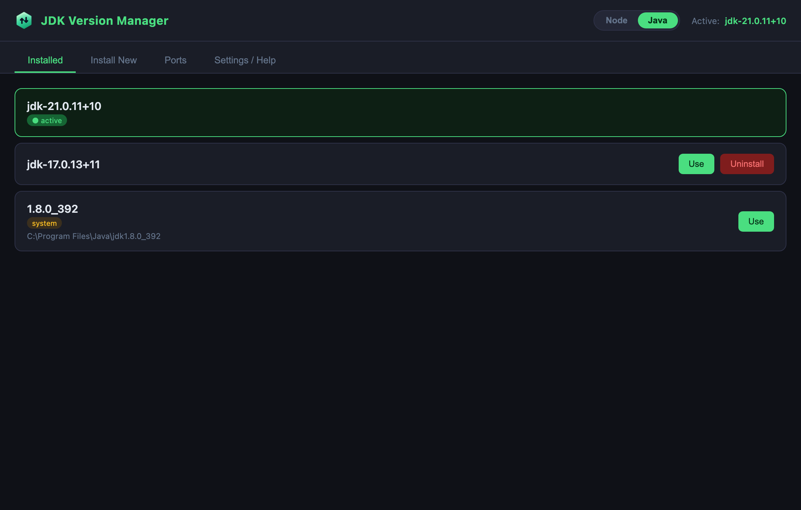

<p align="center">
  
</p>

# NodeVersions
Phần mềm quản lý version Node & JDK (Windows / macOS) — kèm giám sát port và tự động cập nhật.

## Giao diện

| Quản lý version đã cài | Cài version mới |
|:---:|:---:|
|  |  |

| Giám sát Ports | Settings / Auto-update |
|:---:|:---:|
|  |  |

<p align="center">
  
  <br/><em>Cùng một app quản lý luôn cả JDK — gạt công tắc Node | Java trên header.</em>
</p>

## Yêu cầu
- Node.js **>= 20** (khuyến nghị 22 hoặc 24) để chạy toolchain Vite/Electron.

> ⚠️ Nếu máy đang active một bản Node cũ (vd v16 qua chính app này), hãy đưa bản Node mới lên PATH trước khi build/dev:
> ```powershell
> $env:Path = "C:\Users\<user>\.nodevm\versions\v24.16.0;" + $env:Path
> ```

## Phát triển

### Cài dependencies
```bash
npm install
```

### Chạy development
```bash
npm run dev
```
Tự động khởi động Vite renderer + TypeScript watch + Electron.

> Trên Windows nếu app mở lên không có cửa sổ (chạy như Node), hãy gỡ biến môi trường `ELECTRON_RUN_AS_NODE`:
> ```powershell
> Remove-Item Env:\ELECTRON_RUN_AS_NODE -ErrorAction SilentlyContinue
> ```

### Build production (không đóng gói)
```bash
npm run build
```

### Đóng gói installer (.exe) tại máy
```bash
npm run dist
```
> ⚠️ Trên Windows, lệnh này cần **quyền Administrator** hoặc bật **Developer Mode**
> (Settings → Privacy & security → For developers → Developer Mode = On) vì electron-builder
> phải tạo symbolic link khi giải nén công cụ `winCodeSign`. Không có quyền này build sẽ lỗi.
> Nếu chỉ để phát hành, **nên dùng GitHub Actions** (xem bên dưới) thay vì build tại máy.

---

## Phát hành bản mới (Release)

Việc build + phát hành được thực hiện **tự động bằng GitHub Actions**
([.github/workflows/release.yml](.github/workflows/release.yml)) khi bạn **push một tag `v*`**.
CI build **cả Windows (.exe) lẫn macOS (.dmg)** + `latest.yml` (cho auto-update Windows) và tạo GitHub Release.

> **Quan trọng:** trigger là **push tag**, KHÔNG phải nội dung commit message.
> Và `version` trong `package.json` **phải khớp** với tag — vì vậy hãy dùng `npm version`
> để làm cả hai cùng lúc, đừng tự gõ tag thủ công.

### Các bước ra bản mới

```powershell
# 1. Tăng version (tự sửa package.json + tạo commit + tạo tag khớp)
npm version patch        # sửa lỗi nhỏ:   1.0.1 -> 1.0.2
# npm version minor      # thêm tính năng: 1.0.1 -> 1.1.0
# npm version major      # thay đổi lớn:   1.0.1 -> 2.0.0

# 2. Push cả commit lẫn tag -> kích hoạt CI
git push origin main --follow-tags
```

### 3. Publish release
- Theo dõi build tại: **https://github.com/duycamau2016/NodeVersions/actions**
- Khi xong, CI tạo một **Release dạng draft** kèm các file:
  - **Windows:** `Node Version Manager Setup X.Y.Z.exe`, `latest.yml`, `.blockmap`
  - **macOS:** `Node Version Manager-X.Y.Z.dmg` (Intel) và `Node Version Manager-X.Y.Z-arm64.dmg` (Apple Silicon)
- Vào **https://github.com/duycamau2016/NodeVersions/releases** → mở draft → bấm **Publish release**.

> Release còn ở dạng **draft** thì **người dùng không thấy** và **auto-update không nhận**.
> Chỉ sau khi bấm **Publish** mọi thứ mới hoạt động.

### Người dùng tải bản cài ở đâu
Sau khi Publish, gửi cho người dùng link:
```
https://github.com/duycamau2016/NodeVersions/releases/latest
```
- **Windows:** tải `Node Version Manager Setup X.Y.Z.exe`. Cài **một lần** — các bản sau **tự cập nhật**.
- **macOS:** tải file `.dmg` đúng loại chip (arm64 cho Apple Silicon, bản còn lại cho Intel), mở và kéo app vào Applications.

> **macOS chưa ký số:** lần đầu mở, macOS sẽ chặn ("không mở được vì chưa xác định nhà phát triển").
> Cách mở: chuột phải vào app → **Open** → **Open**; hoặc vào System Settings → Privacy & Security →
> bấm **Open Anyway**. Người dùng macOS phải **tự tải bản mới** mỗi lần (không có auto-update — xem bên dưới).

---

## Tự động cập nhật (Auto-update)

- App dùng `electron-updater` + GitHub Releases. Khi mở app, nó âm thầm kiểm tra Release mới nhất;
  nếu có bản mới hơn version hiện tại → tải nền → hiện banner **Restart & Update**.
- So sánh dựa trên `version` trong `package.json` (đọc từ `latest.yml`).
- Có nút **Check for updates** thủ công trong tab **Settings**.
- Auto-update **chỉ chạy ở bản đã đóng gói** (không chạy khi `npm run dev`), và **từ bản Release
  thứ 2 trở đi** (bản đầu tiên là nền để so sánh).
- **macOS:** auto-update hiện **chưa hoạt động** vì app chưa ký số (`identity: null`).

## Tính năng

- Quản lý nhiều version **Node** và **JDK**: cài, gỡ, chuyển đổi (kể cả bản có sẵn trên máy).
- **Ports**: giám sát các cổng đang được process Node/Java lắng nghe, kill nhanh theo PID.
